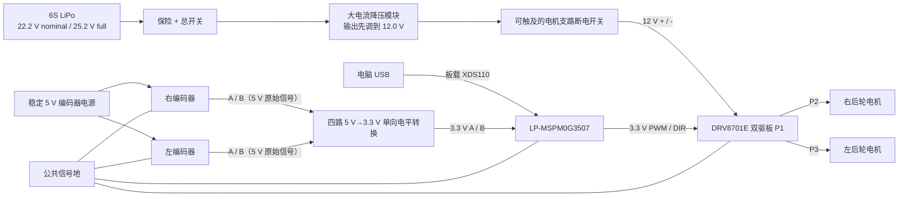

# mspm0dache 实车接线指导

本文对应当前 `mspm0dache` 固件，适用硬件：

- LP-MSPM0G3507 LaunchPad；
- 逐飞科技 DRV8701E 双路有刷电机驱动板，PH/EN 控制；
- 两台 MG513XP28_12V 减速电机；
- 两路 13 PPR、要求 5 V VCC 的推挽输出霍尔编码器；
- 6S 航模锂电池，经降压模块为电机支路提供稳压 12 V；
- LaunchPad 板载 XDS110 调试器和自带 Micro-USB 线。

本版不接蜂鸣器、ICM42688 和 JDY-31。外接八键板 K1～K8 全部接到
LaunchPad；按键只向 MC02 上报选择/停止事件，K1～K5 不能直接启动底盘，
必须等待 MC02 的 PREPARE 和 START。

## 1. 先确定左右

“左”和“右”始终以小车自身朝前时的方向为准。

| 对象 | 当前固件中的固定定义 |
|---|---|
| 右后轮电机 | DRV 电机1/P2，PWM1 + DIR1 |
| 左后轮电机 | DRV 电机2/P3，PWM2 + DIR2 |
| 右后轮编码器 | PB6 + PB7，J2/BP13-BP14，硬件 QEI |
| 左后轮编码器 | PB16 + PB0，J2/BP11-BP12，软件正交解码 |

建议在线束两端贴上 `R-MOTOR`、`L-MOTOR`、`R-ENC`、`L-ENC` 标签。
不要按站在车前面观察时的人眼左右接线。

## 2. 通电前必须遵守

1. 6S 电池标称约 22.2 V、满电约 25.2 V，不能直接进入 12 V 电机、
   LaunchPad 或编码器。
2. 电机支路必须先降到实测 12.0 V。先空载调好降压模块，再接驱动板。
3. 电池正极附近必须有保险和总开关。保险规格要根据两台电机实测启动和
   堵转电流、降压模块能力以及线径确定，这里不猜一个数值。
4. 电池线、DRV 电源线和电机线不能使用面包板或细杜邦线。
5. 首次电机测试必须把两个后轮悬空，并保证随手可以切断 12 V 电机电源。
6. 所有插拔、换线、调驱动板开关操作都必须在电池断开并等待电容放电后进行。
7. 电机带电时不要在调试器中使用断点暂停 CPU；使用 CCS Expressions 动态观察。

## 3. 整机电源拓扑



开发和标定阶段让 LaunchPad 由板载 USB 供电，不要同时向 J11 注入外部 3.3 V。

DRV 的大电流回路应直接返回 12 V 降压模块负极。不要让电机电流经过
LaunchPad 或编码器的细地线。LaunchPad GND、DRV 控制口 GND 和两个编码器
GND 仍然必须共地。

## 4. 一张表完成全部信号接线

BoosterPack 编号是 TI 40 针标准编号。请找板上 `J4`、针号和 MCU 引脚丝印，
不要只根据照片方向数针。

| 功能 | LaunchPad 位置 | 接到外设 |
|---|---|---|
| 右电机 PWM | PA12，BoosterPack 32，J4 区域 | DRV P4 `PWM1` |
| 右电机方向 | PB4，BoosterPack 40，J4 区域 | DRV P4 `DIR1` |
| 左电机 PWM | PA13，BoosterPack 31，J4 区域 | DRV P4 `PWM2` |
| 左电机方向 | PB1，BoosterPack 39，J4 区域 | DRV P4 `DIR2` |
| 驱动逻辑地 | GND，BoosterPack 20 或 22 | DRV P4 `GND` |
| 左编码器 A | PB16，BoosterPack 11，J2 区域 | 左编码器 A |
| 左编码器 B | PB0，BoosterPack 12，J2 区域 | 左编码器 B |
| 右编码器 A | PB6，BoosterPack 13，J2 区域 | 右编码器 A |
| 右编码器 B | PB7，BoosterPack 14，J2 区域 | 右编码器 B |
| 右编码器 VCC | 稳定 5 V 编码器电源；J10/BoosterPack 2 仅在该5V轨确实有电时使用 | 右编码器 VCC |
| 右编码器 GND | GND，BoosterPack 20 或 22 | 右编码器 GND |
| 左编码器 VCC | 稳定 5 V 编码器电源；J10/BoosterPack 2 仅在该5V轨确实有电时使用 | 左编码器 VCC |
| 左编码器 GND | GND，BoosterPack 20 或 22 | 左编码器 GND |
| 外接按钮 K1 | PA10，BoosterPack 34，内部上拉 | 八键板 `SW1` |
| 外接按钮 K2 | PA11，BoosterPack 33，内部上拉 | 八键板 `SW2` |
| 外接按钮 K3 | PB13，BoosterPack 35，内部上拉 | 八键板 `SW3` |
| 外接按钮 K4 | PB20，BoosterPack 36，内部上拉 | 八键板 `SW4` |
| 外接按钮 K5 | PA31，BoosterPack 37，内部上拉 | 八键板 `SW5` |
| 外接按钮 K6 | PA28，BoosterPack 38，内部上拉 | 八键板 `SW6`，底盘软件动力许可开/关 |
| 外接按钮 K7 | PB12，BoosterPack 19，内部上拉 | 八键板 `SW7`，正常停止/复位 |
| 外接按钮 K8 | PB15，BoosterPack 17，内部上拉 | 八键板 `SW8`，锁存急停 |
| 按钮板地 | GND，BoosterPack 20 或 22 | 八键板 `GND` |
| 按钮板电源 | LaunchPad 3V3 | 八键板 `VCC`，禁止接 5 V |
| I2C1 SCL | PB2，BoosterPack 9 | 并接幻尔 `SCL` 与 OLED `SCK` |
| I2C1 SDA | PB3，BoosterPack 10 | 并接幻尔 `SDA` 与 OLED `SDA` |
| OLED 电源 | 外部稳压模块 3.3 V / 系统公共 GND | OLED `VDD` / `GND`；不要接 5 V |
| MC02→TI 串口 | PA9，UART1_RX，J14_3 | MC02 USART1 pin 1，TX / PA9 |
| TI→MC02 串口 | PA8，UART1_TX，J1_4 | MC02 USART1 pin 2，RX / PA10 |
| MC02 信号地 | 系统公共 GND | MC02 USART1 pin 3 / GND |

编码器四根信号线现在连续排列在 J2/BP11-BP14。J12 整组不再使用，保持悬空。

八个按键均为低电平有效：松开时由 TI 内部上拉保持高电平，按下时对应
SW 引脚与 GND 导通。`0xA2 BUTTON_EVENT` 的按下和释放均经过 40 ms
消抖。K7/K8 的本地撤销电机权限不等待 UART：新检测到原始低电平后在
10 ms 控制周期内将左右 PWM 置零并失能；K8 会锁存，松开 K8 不会恢复，
必须在 K8 已释放后按 K7 才能返回待机。按钮板 `VCC` 接 LaunchPad
3V3，禁止接 5 V。

## 5. DRV8701E 双驱板

### 5.1 大电流端

按驱动板的实际丝印接线：

| DRV 端子 | 接线 |
|---|---|
| P1 `+` | 稳压 12.0 V 正极 |
| P1 `-` | 12 V 电源负极 |
| P2/电机1 | 右后轮电机的两根粗动力线 |
| P3/电机2 | 左后轮电机的两根粗动力线 |
| S1 | 接线阶段 `OFF`，确认无误后测试时 `ON` |

不要根据端子左右位置猜正负极，必须看 PCB 丝印并用万用表复核。

### 5.2 P4 控制口

按 P4 每一针的丝印名称连接，不要按排线颜色或连接器朝向猜：

| P4 丝印 | 连接 |
|---|---|
| `GND` | LaunchPad GND |
| `NC` | 保持悬空 |
| `PWM1` | PA12/BP32 |
| `DIR1` | PB4/BP40 |
| `PWM2` | PA13/BP31 |
| `DIR2` | PB1/BP39 |

2026-07-25 的断电测量已经确认：旧版 mode 3 中 PA12 约为 0.48 V，而本应
关闭的 PA13 为 3.28 V；mode 4 的结果相反。通道选择正确，实际问题是旧版
用超出下降计数范围的比较值表示 0% PWM，导致未选中的通道常高。版本
`2026072504` 保留了命令 0% 时把对应 PWM 引脚切换为 GPIO 低电平的修复。重新接通
12 V 前，仍必须在完全断电后用蜂鸣档逐根核对线束，并在只用 USB 供电时
复测四根控制线。禁止在带电状态使用电阻档/蜂鸣档。

当前固件输出 20 kHz PWM。驱动板版本如果不是双驱 V1.3，针的物理排列可能
不同，但丝印功能名不应靠推测替代。上电前最好拍一张驱动板正面清晰照片，
逐项核对 P1、P2、P3、P4 和 S1。

## 6. 电机和编码器

每台电机通常有：

- 两根较粗电机动力线，只接 DRV 的 P2 或 P3；
- 编码器 VCC、GND、A、B 四根细线，只接 LaunchPad 侧。

不同批次线色可能不同，不要套用网上的通用颜色表。先用电机随附定义或原线束
记录确认 VCC/GND/A/B。

### 6.1 编码器供电

用户已确认当前安装的编码器要求 5 V VCC。编码器使用稳定 5 V 供电，但其
推挽 A/B 输出不能直接送入 MSPM0。

2026-07-28 用户用电压表确认：编码器 VCC 直接取自 LaunchPad/MSPM0 的 5 V
电源轨，编码器供电接口实测为 5 V。供电链路已确认，原始 A/B 高电平仍待测量。

接入 A/B 之前仍要用示波器测量：

- VCC 对 GND 应约为 5 V；
- 四路 A/B 必须经过可靠的 5 V 到 3.3 V 单向电平转换；
- 电平转换器 MCU 侧的 A、B 高电平不得超过 3.3 V；
- 手转电机时 A、B 都应在高低电平之间变化。

只有实测证明某一路原始 A/B 高电平不超过 3.3 V 时，才可评估省略该路转换；
在证明之前一律按 5 V 推挽输出处理。5 V 推挽 A/B 绝不能直接接入 MSPM0。

### 6.2 抗干扰布线

- 两根电机动力线互相绞合；
- 编码器 A 与 GND、B 与 GND 分别成对走线；
- 编码器线不要和电机线、降压模块电感长距离并行捆扎；
- 驱动板和降压模块靠近电机，LaunchPad 与编码器信号线远离功率电感；
- 连接器做防反插、拉力固定和左右标签；
- 不要热插拔编码器、DRV 控制口或电机端子。

## 7. 板载 XDS110 和 USB

本项目现在使用 LaunchPad 自带的 XDS110，不需要连接任何额外调试线：

1. 把 `J101` 上的 `GND`、`5V`、`3V3`、`NRST`、`SWDIO`、`SWCLK` 等跳帽
   全部恢复到出厂安装状态。
2. `J102`、`J103` 全部保持悬空。
3. 不向 `J11` 注入外部 3.3 V。
4. 用开发板自带的 Micro-USB 线连接板载 XDS110 USB 口和电脑。
5. 电脑应识别到 `XDS110 Class Application/User UART` 和 XDS110 调试器。
6. 在 VS Code 中运行 `Build and Flash MSPM0 (onboard XDS110)` 完成编译和
   下载；命令行等价命令为：

   ```powershell
   C:\ti\ccs\utils\bin\gmake.exe -C . flash
   ```

Ozone 不能使用 XDS110。需要动态修改 `g_test` 时，通过相同 USB 线在 CCS
调试器的 Expressions 视图中操作；源码编辑和 Makefile 编译仍在 VS Code。

## 8. 分阶段接线与检查

不要一次把所有电源和电机都接上。按以下顺序，每阶段通过后才进入下一阶段。

### 阶段 A：LaunchPad 和板载 XDS110

1. 电池、降压模块和 DRV 全部断开。
2. 恢复 J101 全部出厂跳帽，J102/J103 保持悬空。
3. 只插 LaunchPad 的 Micro-USB 线。
4. 在 VS Code 运行 `Build and Flash MSPM0 (onboard XDS110)`。
5. 需要动态调参时，在 CCS Expressions 中加入 `g_test`、`g_motor` 和
   `g_test`。
6. 复位后确认 `g_test.mode = 0`、`g_test.arm = 0`，PA12/PA13 没有有效 PWM。

### 阶段 B：只接两个编码器

1. 保持 DRV 和 12 V 电机电源断开。
2. 两个编码器先只接稳定 5 V 和 GND，测量电源正确。
3. 四路 A/B 分别经过 5 V 到 3.3 V 单向电平转换，并测量 MCU 侧高电平
   不超过 3.3 V 后，才连接 J2/BP11-BP14。
4. 设置 `g_test.mode = 2` 清零，再设置 `g_test.mode = 1`。
5. 分别向车辆前进方向手转左右轮，观察 `left_count` 和 `right_count`。
6. 确认转一圈有稳定计数、左右没有串线。2026-07-25 已测得左轮约1467、
   右轮约1468 counts/rev；更换编码器或减速箱后重新测量。

模式 1 和 2 不需要 `arm`，电机不会启动。

### 阶段 C：只接 DRV 控制线

1. DRV 的 S1 保持 `OFF`，P1 暂时不接 12 V，电机也不接。
2. 完全断电，用蜂鸣档逐根证明 PWM1=PA12/BP32、DIR1=PB4/BP40、
   PWM2=PA13/BP31、DIR2=PB1/BP39，且相邻线之间没有短路。
3. 连接 P4 的 GND、PWM1、DIR1、PWM2、DIR2，`NC` 悬空。
4. 只用 USB 供电，在复位和 mode 0 时测量 PA12、PA13、PB4、PB1，四根
   必须全部为 0 V。
5. mode 3 时只有 PA12 应出现 20 kHz PWM；mode 4 时只有 PA13 应出现
   20 kHz PWM。每次改回 mode 0 后，四根线必须在 10 ms 内全部回到低电平。
6. 此时不建议依靠 DRV 输出判断，因为 P1 未供电；这里只检查 MCU 控制线
   是否接对和是否短路。

### 阶段 D：接 12 V 和电机，车轮悬空

1. 两个后轮悬空，车体固定，S1 仍为 `OFF`。
2. 降压模块与 DRV 断开时，先空载调到 12.0 V。
3. 断电后，把 12 V 正负极接到 P1，再把右电机接 P2、左电机接 P3。
4. 万用表检查 P1 没有反接，确认后将 S1 置 `ON`。
5. 在 CCS Expressions 中先设：

   ```text
   g_test.duration_ms = 3000
   ```

6. 单独测试右轮：先写 `g_test.arm = 1`，最后写 `g_test.mode = 3`。
7. 停止后单独测试左轮：先写 `g_test.arm = 1`，最后写 `g_test.mode = 4`。
8. 单轮方向和编码器符号都正确后，再用 mode 5 测双轮前进、mode 6 测双轮
   后退。

每次运动命令必须按“参数 -> `arm = 1` -> 最后写 mode”的顺序。写 mode 0
会停止并撤销使能。

如果某一轮转向相反，立即 mode 0 并切断 12 V。只修改一个维度：

- 电机机械方向错：交换该电机的两根 P2/P3 动力线，或修改对应
  `MOTOR_*_OUTPUT_REVERSED`；
- 轮子方向正确但计数符号错：交换该编码器 A/B，或修改对应
  `ENCODER_*_REVERSED`；
- 不要同时交换电机线和编码器 A/B，否则难以判断是哪一侧定义错误。

## 9. 最终核对清单

### 电源

- [ ] 6S 电池正极附近已有保险和总开关；
- [ ] 6S 满电电压没有直接进入 12 V、5 V 或 3.3 V 负载；
- [ ] 降压模块空载输出实测为 12.0 V，极性正确；
- [ ] P1 `+/-` 没有接反；
- [ ] LaunchPad 开发阶段仅由 USB 供电，J11 没有外部电源；
- [ ] 电机大电流回路没有经过 LaunchPad 的 GND 线；
- [ ] LaunchPad、DRV P4 和两个编码器已经共地。

### 驱动和电机

- [ ] P2/电机1接物理右后轮，P3/电机2接物理左后轮；
- [ ] P4 `GND` 已接，`NC` 保持悬空；
- [ ] PWM1=PA12/BP32，DIR1=PB4/BP40；
- [ ] PWM2=PA13/BP31，DIR2=PB1/BP39；
- [ ] 首次测试时后轮悬空，开环诊断固定为 15% PWM；
- [ ] 可以随手切断 12 V 电机支路。

### 编码器

- [ ] 两个编码器使用稳定 5 V 供电；
- [ ] 四路 A/B 已经过 5 V 到 3.3 V 单向电平转换；
- [ ] 电平转换后 MCU 侧 A/B 高电平实测不超过 3.3 V；
- [ ] 左 A=PB16/BP11，左 B=PB0/BP12；
- [ ] 右 A=PB6/BP13，右 B=PB7/BP14；
- [ ] J12 整组保持悬空；
- [ ] 向前手转时左右计数方向符合固件约定；
- [ ] 已分别记录左右轮实际每圈计数。

### XDS110和USB

- [ ] J101 全部恢复出厂跳帽状态；
- [ ] J102、J103 没有连接任何线；
- [ ] J11 没有外部3.3V输入；
- [ ] 只用 LaunchPad Micro-USB 连接电脑；
- [ ] Windows 已识别板载 XDS110；
- [ ] VS Code 的 XDS110 下载任务可以识别目标。

## 10. 现在不要连接的东西

- ICM42688：总线、引脚和安装方向尚未确定；
- Jetson UART：本项目明确不使用；
- 板载 S2/PB21：当前未分配；
- JDY-31：已拔掉，UART0 当前停用；
- 蜂鸣器：当前 SysConfig 没有分配；
- 任何 5 V 推挽编码器 A/B：未经过电平转换前不得连接；
- 6S 电池原始电压：不得直接连接 DRV 的 12 V 电机支路。

## 11. 参考依据

- [TI LP-MSPM0G3507 官方产品页](https://www.ti.com/tool/LP-MSPM0G3507)
- [TI LP-MSPM0G3507 用户指南 Rev. D](https://www.ti.com/lit/slau873d)
- [逐飞科技 DRV8701E 有刷电机驱动开源资料](https://gitee.com/seekfree/DRV8701E_Brush_Driver_Project)
- [JDY-31 蓝牙 SPP 串口透传模块说明书](https://www.es.co.th/Schemetic/PDF/JDY-31-K1234.PDF)
- 本工程 `mspm0dache.syscfg`、`chassis_config.h` 和 `AGENT.MD`

## 12. 外接八键板 K1～K8

build `2026073012` 接入全部八个按键，均为低电平有效：

| 八键板 | 连接位置 |
|---|---|
| `GND` | 系统公共 GND |
| `VCC` | LaunchPad `3V3`，禁止接 5 V |
| `SW1` | PA10 / BoosterPack 34 |
| `SW2` | PA11 / BoosterPack 33 |
| `SW3` | PB13 / BoosterPack 35 |
| `SW4` | PB20 / BoosterPack 36 |
| `SW5` | PA31 / BoosterPack 37 |
| `SW6` | PA28 / BoosterPack 38，底盘软件动力许可开/关 |
| `SW7` | PB12 / BoosterPack 19，正常停止/复位 |
| `SW8` | PB15 / BoosterPack 17，锁存急停 |

八个 GPIO 都配置内部上拉；松开为高电平，按下时对应 SW 引脚被拉到
GND。不要把任一 SW 引脚接到 5 V。按钮板按丝印 `SW1`～`SW8` 接线，
不要按颜色或照片方向猜。

实测 VCC 悬空时，SW1 松开只有 2.16 V、按下为 0 V。2.16 V 不能作为可靠
的 3.3 V GPIO 高电平，因此按钮板 VCC 改接 LaunchPad 3V3。重新上电后必须
复测：松开约 3.3 V、按下约 0 V，合格后才能接通电机电源。

当前 `STANDALONE_KEY1_START=0`：K1～K5 按下后向 MC02 发送选择事件，
但 TI 不直接启动车轮。MC02 必须完成
`PREPARE -> READY -> 3 秒倒计时 -> START`，TI 随后再确认 5 个新的有效
巡线样本才允许启动。Q1以130 RPM基础速度跑一圈、40秒安全上限（评分目标仍为20秒内）；Q2全程
重复强制失能并等待MC02的SAFE_STOP；Q3沿线从A行驶1500 mm，基础速度
100 RPM，最后250 mm降至45 RPM、最后50 mm再降至20 RPM并在B停车，
8秒上限；Q4/Q5复用Q1路线，
基础速度降至100 RPM，30秒上限。K6在TI和MC02均完全待机且通信在线时
把软件动力许可从0切换到1；再次按K6，或在运行/倒计时期间按K6，会立即
零PWM、失能并把许可切回0。Q1/Q3/Q4/Q5只有在`PWR 1`时才接受，
Q2不需要动力许可并强制保持`PWR 0`。每次SAFE_STOP、K7、K8、故障或
通信丢失都会回到`PWR 0`，所以下一道运动题需要重新按K6。K7/K8的本地零PWM不等待
MC02；K8松开后必须再按K7清除锁存。上电时一直按住K1～K7不会触发，
必须先松开再按。Q2～Q5仍需实车验证，尤其Q3的1500 mm停车点需要根据
轮胎打滑和车辆参考点复核。

## 13. 幻尔 8 路巡线模块接线

模块确认为 `LineFollower_8CH V1.0`，额定电源为 5 V，I2C 7 位地址为
`0x5D`。本工程使用 I2C，不使用模块的 TX/RX 或 S1-S8 并行输出：

| 巡线模块 | 连接位置 |
|---|---|
| `5V` | 稳定 5 V 辅助电源，不接 J11 3V3 |
| `GND` | 系统公共 GND |
| `SCL` | PB2 / BoosterPack 9 / I2C1 SCL |
| `SDA` | PB3 / BoosterPack 10 / I2C1 SDA |
| `TX`、`RX` | 悬空 |
| `S1` 至 `S8` | 悬空 |

首次接线必须分两步：

1. PB2/PB3 暂时断开，只给巡线模块接 5V/GND。模块上电后测量
   `SCL`、`SDA` 对 GND 的空闲电压；
2. 两路都不高于 3.3 V，才能断电后直接接 PB2/PB3；若任一路高于
   3.3 V，必须在模块和 LaunchPad 之间加入双向 I2C 电平转换器。

电压确认前不要凭“模块能接树莓派”直接连接 MSPM0。信号线与电机动力线、
降压模块电感分开布线。当前固件由 MC02 响应 KEY1 后启动并根据巡线数据控制两轮；
首次测试必须架空驱动轮。

## 14. OLED 行驶时间显示

照片中的四针模块丝印依次为 `GND VDD SCK SDA`。build `2026073012`
按 128x64 SSD1306 兼容 I2C 模块驱动，启动时依次尝试地址 `0x3C` 和
`0x3D`。它与幻尔模块共用 I2C1：

| OLED | 连接位置 |
|---|---|
| `GND` | 系统公共 GND |
| `VDD` | 外部稳压模块的稳定 `3.3V` 输出，不要接 5 V |
| `SCK` | PB2 / BoosterPack 9 / I2C1 SCL |
| `SDA` | PB3 / BoosterPack 10 / I2C1 SDA |

OLED 和幻尔模块地址不同，因此可以并联同一组 SCL/SDA。当前实车的 OLED
电源直接接外部稳压模块的 3.3 V 输出；该稳压模块 GND、OLED GND、TI GND
和 MC02 GND 必须共地。OLED 使用 3.3 V 供电可确保板载上拉不会把 MSPM0
的 I2C 线拉到 5 V。屏幕显示`TIME`和整数秒数，并增加`PWR 0/1`：
`PWR 0`表示TI软件禁止底盘电机输出，`PWR 1`只表示允许后续MC02
PREPARE/START使能电机；它不表示12 V电源被继电器物理断开。按下有效题目按键时
从 0 秒开始，题目完成、取消、故障或安全停车时冻结；OLED 缺失或通信失败
不会改变电机安全逻辑。当前八个物理按键和五个内部题号的底盘行为均已
在源码中接入；Q2～Q5尚未完成硬件路线验证。

## 15. MC02 通信线（两端已编译，尚未台架联调）

TI 与达妙 `DM-MC-Board02` 之间计划使用 `3.3 V TTL UART`，
`115200 8-N-1`、无硬件流控。只连接交叉的 TX/RX 和公共信号地，
禁止把两块板的 3.3 V 或 5 V 电源相连：

| MC02 USART1 | TI LP-MSPM0G3507 | 方向 |
|---|---|---|
| pin 1，USART1_TX / PA9 | UART1_RX / PA9 | MC02 → TI |
| pin 2，USART1_RX / PA10 | UART1_TX / PA8 | TI → MC02 |
| pin 3，GND | 系统公共 GND | 信号参考 |

TI SDK 的 LP-MSPM0G3507 `uart_echo` 示例确认 `UART1_RX=PA9`
（J14_3）、`UART1_TX=PA8`（J1_4），build `2026073012` 已由 SysConfig
生成 UART1。正式接线前断开 J101 的 UART RX/TX 路由（7:8、9:10），避免
XDS110 与外部设备同时驱动信号；保留 J101 的 SWDIO/SWCLK 调试连接
（13:14、15:16）。TI build `2026073012` 与 MC02 build
`2026073013` 已完成编译和静态检查；首次实际相连必须断开两侧电机电源，
先确认状态帧、CRC、重复命令、心跳和 SAFE_STOP，再做架空轮测试。

通信帧、题号、按键事件、状态和看门狗定义以
`../gimbal_MC02/docs/MC02_TI_PROTOCOL_V2.md` 为准。
